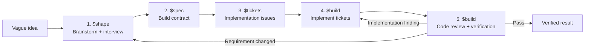

<div align="center">

# Codex Skills

**A small skill library for turning vague ideas into reviewed, verified software.**


</div>

The build workflow has one default path:

```text
brainstorm -> spec -> tickets -> build -> review
```

Use `$flow` when you want Codex to run the whole process or resume from work that already exists:

```text
Use $flow to take this vague idea through shape, spec, tickets, build, and review: <idea>
```

## The Process



`$flow` is the wrapper around the sequence, not a sixth phase. It inspects the current state and starts at the first incomplete phase.

## Five Phases, Four Skills

| Phase | Skill | What happens |
| --- | --- | --- |
| 1. Brainstorm | [`$shape`](./shape) | Codex inspects known facts, then grills you one important decision at a time and records a confirmed brief. |
| 2. Spec | [`$spec`](./spec) | The confirmed brief becomes the canonical product and technical specification. |
| 3. Tickets | [`$tickets`](./tickets) | The spec becomes one or more ready issues with acceptance criteria, dependencies, and verification. |
| 4. Build | [`$build`](./build) | Codex implements ready tickets and uses [`$tdd`](./tdd) when a test-first loop is useful. |
| 5. Review | [`$build`](./build) | Codex reviews spec compliance and code quality, fixes findings, and reruns the real checks. |

Review stays inside `$build` because every implementation should be reviewed. There is no extra review command to remember.

## Helpers, Not Phases

These skills are available when the core process needs extra evidence or continuity. They are never mandatory stops.

| Skill | Use it when |
| --- | --- |
| [`$map`](./map) | The project is unusually large and the unresolved decisions cannot fit one shaping pass. |
| [`$research`](./research) | A decision depends on current documentation, APIs, standards, papers, or source code. |
| [`$prototype`](./prototype) | A product or technical decision must be seen or run before it can be settled. |
| [`$tdd`](./tdd) | A build ticket has a valuable automated behavior seam for red, green, and refactor. |
| [`$handoff`](./handoff) | Work must pause or move to another Codex task or agent. |

The helper returns its evidence to the active phase. The main sequence does not change.

## Tickets Can Live Anywhere

`$tickets` keeps the same issue contract regardless of destination:

- local Markdown files by default;
- GitHub Issues when explicitly requested;
- Linear or another tracker when explicitly requested and available.

A small spec can produce one ticket. A larger spec becomes a dependency-aware set that `$build` works from the unblocked frontier.

## Start From What Already Exists

The workflow does not force busywork:

- A vague idea starts at `$shape`.
- A confirmed brief starts at `$spec`.
- A ready spec starts at `$tickets`.
- Existing issues start at `$build`.
- An existing implementation starts at the review phase in `$build`.

## Other Skills

| Skill | What it does |
| --- | --- |
| [`goalstorm`](./goalstorm) | Turns a defined outcome into disjoint parallel-agent ownership, synthesis, and verification. |
| [`copywriting`](./copywriting) | Writes and rewrites social, product, email, and repository copy in my voice. |

## Install

Clone the repository:

```bash
git clone https://github.com/adukhan98/skills.git
cd skills
```

Install the full build workflow without overwriting existing copies:

```bash
DEST="$HOME/.codex/skills"
mkdir -p "$DEST"

for skill in flow shape map research prototype spec tickets tdd build handoff; do
  if [ -e "$DEST/$skill" ]; then
    echo "skip existing: $skill"
  else
    cp -R "$skill" "$DEST/"
  fi
done
```

Restart Codex after installation so the skill list refreshes.

## Operating Defaults

- Existing repository instructions and artifacts stay authoritative.
- Local files are the default source of truth.
- External issues are created only when explicitly requested.
- Existing branches and unrelated dirty changes are preserved.
- Material decisions are asked one at a time; routine reversible choices can be delegated.
- Completion requires implementation, review, and real verification evidence.
