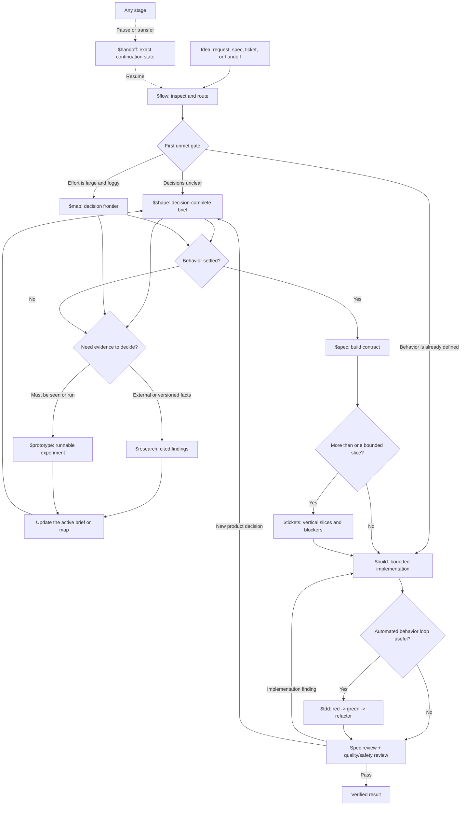

<div align="center">

# Codex Skills

**Small, composable skills for thinking clearly, building carefully, and finishing with evidence.**


</div>

This is my working library of personal Codex skills. The main collection is an end-to-end build flow: start with an unclear idea, resolve the right decisions, prototype what cannot be settled in prose, turn the result into implementation work, and keep going until the change is verified.

The skills stay separate on purpose. You can run the entire flow with one router or invoke only the stage you need.

## Start Here

Use `$flow` when you want Codex to choose the right path or carry a project end to end:

```text
Use $flow to take this idea from ambiguity to a verified implementation: <idea>
```

You only need to remember four commands:

| Command | Use it when |
| --- | --- |
| `$flow` | You want to start, resume, or route any build. |
| `$shape` | The idea still has unresolved product or design decisions. |
| `$build` | The work is defined and ready to implement. |
| `$handoff` | The work must pause, branch, or move to a fresh Codex task. |

Everything else is a named stage that `$flow` can select for you.

## The Build Flow



This is a loop, not a mandatory waterfall:

- A clear one-slice change can go straight to `$build`.
- Research and prototypes return evidence to the active decision artifact.
- A spec that exposes a missing decision returns to `$shape`.
- Build findings loop through `$build`/`$tdd`, or back to `$shape` when the missing piece is product behavior.
- A handoff can happen at any stage without restarting the work.

## Build Skills

| Skill | What it does | Produces |
| --- | --- | --- |
| [`flow`](./flow) | Routes or resumes the entire process from the first unmet gate. | The next completed stage or an exact continuation gate. |
| [`shape`](./shape) | Resolves product and design branches one material decision at a time. | A decision-complete brief. |
| [`map`](./map) | Charts multi-task uncertainty as a destination, frontier, blockers, and fog. | A durable decision map. |
| [`research`](./research) | Investigates decision-critical facts with current, high-trust evidence. | Cited findings and project implications. |
| [`prototype`](./prototype) | Builds one disposable logic or UI experiment to settle one question. | A runnable artifact and recorded verdict. |
| [`spec`](./spec) | Synthesizes settled decisions into one canonical build contract. | An implementation-ready specification. |
| [`tickets`](./tickets) | Splits a ready spec into vertical slices with true blocking edges. | A coverage index and one file per ticket. |
| [`tdd`](./tdd) | Implements one behavior through red, green, and refactor at a stable seam. | Tests, implementation, and loop evidence. |
| [`build`](./build) | Implements defined work, reviews it on two axes, and verifies the real surface. | A reviewable diff and exact verification evidence. |
| [`handoff`](./handoff) | Captures repository, plan, agent, decision, and verification state for continuation. | A durable handoff with the next action. |

## Other Skills

| Skill | What it does |
| --- | --- |
| [`goalstorm`](./goalstorm) | Turns a defined outcome into disjoint parallel-agent ownership, synthesis, and verification. |
| [`copywriting`](./copywriting) | Writes and rewrites social, product, email, and repository copy in my voice. |

## The Important Distinctions

### `$shape` vs `$spec`

`$shape` resolves what the product should do. `$spec` records decisions that are already settled. If a spec still requires the agent to invent product behavior, the work goes back to `$shape`.

### `$map` vs `$tickets`

`$map` tracks questions whose answers are not known yet. `$tickets` tracks delivery whose behavior is already decided. Mixing them hides uncertainty inside implementation tasks.

### `$prototype` vs `$build`

`$prototype` is disposable evidence. Its validated decisions move forward; the prototype itself does not silently become production code. `$build` reimplements the chosen direction with normal tests, safety, and review.

### `$tdd` inside `$build`

`$tdd` is a feedback loop, not a paperwork stage. `$build` selects it when observable behavior benefits from a red-green-refactor cycle and uses proportional alternatives for migrations, generated output, visual work, and mechanical changes.

## Defaults That Keep The Flow Safe

- Local files are the source of truth unless an existing project convention says otherwise.
- GitHub, Linear, or another external tracker is mutated only when explicitly requested.
- Commits, pushes, deploys, production writes, and issue closure are never automatic completion steps.
- Existing branches and dirty worktrees are preserved.
- Facts are inspected locally before the user is asked.
- Material decisions are asked one at a time; routine reversible choices can be delegated.
- Parallel agents receive disjoint ownership; the parent integrates and verifies.
- Every final result reports real checks, failures, skipped checks, and remaining risks.

## Install

Clone the repository:

```bash
git clone https://github.com/adukhan98/skills.git
cd skills
```

Install one skill:

```bash
DEST="${CODEX_HOME:-$HOME/.codex}/skills"
mkdir -p "$DEST"
cp -R flow "$DEST/"
```

Install the full build flow without overwriting existing copies:

```bash
DEST="${CODEX_HOME:-$HOME/.codex}/skills"
mkdir -p "$DEST"

for skill in flow shape map research prototype spec tickets tdd build handoff; do
  if [ -e "$DEST/$skill" ]; then
    echo "skip existing: $skill"
  else
    cp -R "$skill" "$DEST/"
  fi
done
```

Restart Codex after installation so the skill list refreshes.

## Skill Anatomy

```text
skill-name/
|-- SKILL.md
|-- agents/
|   `-- openai.yaml
|-- references/        # only when progressive disclosure helps
`-- LICENSE.txt        # included on adapted MIT-licensed skills
```

- `SKILL.md` is the behavioral source of truth.
- `agents/openai.yaml` supplies the Codex display name, short description, and default prompt.
- `references/` keeps branch-specific detail out of the main instruction body.

## Maintaining The Library

Every line in a skill should change behavior. Remove no-op prose, duplicated rules, speculative branches, and instructions the agent already follows by default.

Before publishing a change, check:

1. frontmatter parses and contains only `name` and `description`;
2. the folder name matches the frontmatter name;
3. `agents/openai.yaml` parses and its default prompt names the exact `$skill`;
4. referenced files exist;
5. realistic forward tests exercise the workflow instead of merely reviewing its prose;
6. local and installed copies are identical.

## Attribution

The build-flow skills were adapted from selected engineering and productivity skills in [mattpocock/skills](https://github.com/mattpocock/skills), licensed under MIT. The original 2026 Matt Pocock copyright and MIT permission notice are included in every adapted skill as `LICENSE.txt`.

`goalstorm` and `copywriting` are original personal skills in this repository.
